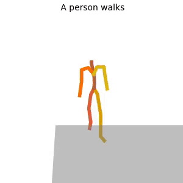
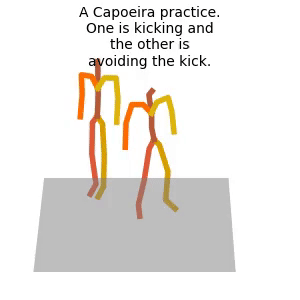
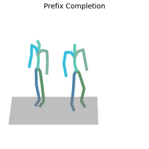
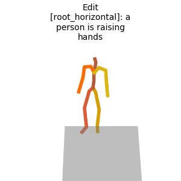
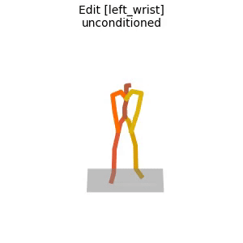
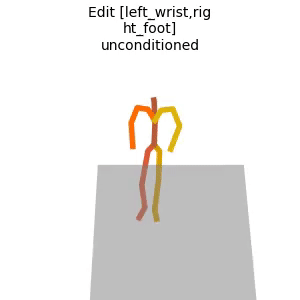

# PriorMDM: Human Motion Diffusion as a Generative Prior


[](https://arxiv.org/abs/2303.01418)

The official PyTorch implementation of the paper [**"Human Motion Diffusion as a Generative Prior"(ArXiv)**](https://arxiv.org/abs/2303.01418).

Please visit our [**webpage**](https://priormdm.github.io/priorMDM-page/) for more details.


#### Bibtex
If you find this code useful in your research, please cite:

```
@article{shafir2023human,
  title={Human motion diffusion as a generative prior},
  author={Shafir, Yonatan and Tevet, Guy and Kapon, Roy and Bermano, Amit H},
  journal={arXiv preprint arXiv:2303.01418},
  year={2023}
}
```


## Release status

|  | Training | Generation | Evaluation |
| --- | ----------- | ----------- | ----------- |
| **DoubleTake (long motion)** | ✅ | ✅ | ✅ |
| **ComMDM (two-person)** | ✅ | ✅ | ✅ |
| **Fine-tuned motion control** | ✅ | ✅ | ✅ |

## News

📢 **29/Apr/2023** - Evaluation release of the long-motions scripts, including both datasets (BABEL & HumanML3D) - please check the updated readme.

📢 **25/Apr/2023** - Full release of the fine-tuned motion control scripts.

📢 **14/Apr/2023** - First release - DoubleTake/ComMDM - Training and generation with pre-trained models is available.

## Getting started

This code was tested on `Ubuntu 18.04.5 LTS` and requires:

* Python 3.8
* conda3 or miniconda3
* CUDA capable GPU (one is enough)

### 1. Setup environment 

Install ffmpeg (if not already installed):

```shell
sudo apt update
sudo apt install ffmpeg
```
For windows use [this](https://www.geeksforgeeks.org/how-to-install-ffmpeg-on-windows/) instead.

Setup conda env:
```shell
conda env create -f environment.yml
conda activate PriorMDM
python -m spacy download en_core_web_sm
pip install git+https://github.com/openai/CLIP.git
pip install git+https://github.com/GuyTevet/smplx.git
```

### 2. Get MDM dependencies

PriorMDM share most of its dependencies with the original MDM. 
If you already have an installed MDM from the official repo, you can save time and link the dependencies instead of getting them from scratch.

<details>
  <summary><b>If you already have an installed MDM</b></summary>

**Link from installed MDM**

Before running the following bash script, first change the path to the full path to your installed MDM

```bash
bash prepare/link_mdm.sh
```

</details>


<details>
  <summary><b>First time user</b></summary>

**Download dependencies:**

```bash
bash prepare/download_smpl_files.sh
bash prepare/download_glove.sh
bash prepare/download_t2m_evaluators.sh
```

**Get HumanML3D dataset** (For all applications):

Follow the instructions in [HumanML3D](https://github.com/EricGuo5513/HumanML3D.git),
then copy the result dataset to our repository:

```shell
cp -r ../HumanML3D/HumanML3D ./dataset/HumanML3D
```

</details>

### 3. Get PriorMDM dependencies

<details>
  <summary><b>DoubleTake (Long sequences)</b></summary>

**BABEL dataset**

Download the processed version [here](https://drive.google.com/file/d/18a4eRh8mbIFb55FMHlnmI8B8tSTkbp4t/view?usp=share_link), and place it at `./dataset/babel`

Download the following for evaluation [here](https://drive.google.com/file/d/1rQWTzTYG6aFiIYHyULlrtUAUvndBDyuD/view?usp=share_link), and place is at `./dataset/babel`

**SMPLH dependencies**

Download [here](https://drive.google.com/file/d/1zHTQ1VrVgr-qGl_ahc0UDgHlXgnwx_lM/view?usp=share_link), and place it at `./bodymodels`


</details>

<details>
  <summary><b>ComMDM (two-person)</b></summary>

**3DPW dataset**

For ComMDM, we cleaned [3DPW](https://virtualhumans.mpi-inf.mpg.de/3DPW/) and converted it to HumanML3D format. 

Download the processed version [here](https://drive.google.com/file/d/1INxPiUuyrBAF71WjVj4Ztb1blsI2trth/view?usp=share_link), and place it at `./dataset/3dpw`

</details>

  **Fine-tuned motion control** - No extra dependencies.


### 4. Download the pretrained models

Download the model(s) you wish to use, then unzip and place it in `./save/`.

<details>
  <summary><b>DoubleTake (long motions)</b></summary>

* [my_humanml-encoder-512](https://drive.google.com/file/d/1RCqyKfj7TLSp6VzwrKa84ldEaXmVma1a/view?usp=share_link) (This is a reproduction of MDM best model without any changes)
* [Babel_TrasnEmb_GeoLoss](https://drive.google.com/file/d/1sHQncaaYhyheeItnAiDOsxw_mpcbpLYr/view?usp=share_link)

</details>

<details>
  <summary><b>ComMDM (two-person)</b></summary>

* [pw3d_text](https://drive.google.com/file/d/1QFIEUd8TEto0AoVQnzsWflrrbHJBZJOG/view?usp=share_link) (for text-to-motion)
* [pw3d_prefix](https://drive.google.com/file/d/10DL9iOr5VlgsikTVvV_sJ8oX86ycd9xE/view?usp=share_link) (for prefix completion)

</details>

<details>
  <summary><b>Fine-tuned motion control</b></summary>

* [root_horizontal_control](https://drive.google.com/file/d/1xLNza6S8Iz2MqSlMJnL38FPqTQhGnqfY/view?usp=share_link) 
(Finetuned the base model for 80,000 steps on (horizontal part of) root control objective)
* [left_wrist_control](https://drive.google.com/file/d/17h98FQhu6dFj70YCopFHT4sL6jZOf42U/view?usp=share_link)
(Finetuned the base model for 80,000 steps on left wrist control objective)
* [right_foot_control](https://drive.google.com/file/d/1QqHAYZ3hbDtsHwJ2Gy4nsfgMwaHvnSOq/view?usp=share_link)
(Finetuned the base model for 80,000 steps on right foor control objective)

</details>

## Motion Synthesis 
<details>
  <summary><b>DoubleTake (long motions)</b></summary>

Reproduce random text prompts:
```shell
python -m sample.double_take --model_path ./save/my_humanml_trans_enc_512/model000200000.pt --num_samples 4 --handshake_size 20 --blend_len 10
```
Reproduce out of text file:
```shell
python -m sample.double_take --model_path ./save/my_humanml_trans_enc_512/model000200000.pt --handshake_size 20 --blend_len 10 --input_text ./assets/dt_text_example.txt 
```

Reproduce out of csv file (can determine each sequence length):
```shell
python -m sample.double_take --model_path ./save/my_humanml_trans_enc_512/model000200000.pt --handshake_size 20 --blend_len 10 --input_text ./assets/dt_csv_example.csv 
```

It will look something like this:



</details>


<details>
  <summary><b>ComMDM (two-person)</b></summary>

**Text-to-Motion**

Reproduce paper text prompts:
```shell
python -m sample.two_person_text2motion --model_path ./save/pw3d_text/model000100000.pt --input_text ./assets/two_person_text_prompts.txt
```

It will look something like this:



**Prefix completion**

Complete unseen motion prefixes:
```shell
python -m sample.two_person_prefix_completion --model_path ./save/pw3d_prefix/model000050000.pt
```

It will look something like this:



Blue frames are the input prefix and orange frames are the generated completion.


**Visualize dataset**

Unfortunately, 3DPW dataset is not clean, even after our process. To get samples of it run:
```shell
python -m sample.two_person_text2motion --model_path ./save/humanml_trans_enc_512/model000200000.pt --sample_gt
```

</details>

<details>
  <summary><b>Fine-tuned motion control</b></summary>

**Horizontal Root Control**

Sample the horizontal part of the root trajectory from the test set of HumanML3D, and generate a motion with the given trajectory (note that the vertical part of the trajectory is predicted by the model). To make the generation unconditioned on text we add `--guidance_param 0`.
```shell
python -m sample.finetuned_motion_control --model_path save/root_horizontal_finetuned/model000280000.pt --guidance_param 0
```

It will look something like this:



Use `--show_input` if you wish to plot the motion from which the control features were taken from.

Add a text condition with `--text_condition`. Note that by default, we use classifier-free-guidance with scale of 2.5.
```shell
python -m sample.finetuned_motion_control --model_path save/root_horizontal_finetuned/model000280000.pt --text_condition "a person is raising hands"
```

**Left Wrist Control**

Sample the relative trajectory of the left wrist w.r.t the root trajectory from the test set of HumanML3D, and generate a motion with the given left wrist relative trajectory. To make the generation unconditioned on text we add `--guidance_param 0`.
```shell
python -m sample.finetuned_motion_control --model_path save/left_wrist_finetuned/model000280000.pt --guidance_param 0
```

It will look something like this:



Add a text condition with `--text_condition`. Note that by default, we use classifier-free-guidance with scale of 2.5.
```shell
python -m sample.finetuned_motion_control --model_path save/left_wrist_finetuned/model000280000.pt --text_condition "a person is walking in a circle"
```


**Left Wrist + Right Foot Control With Model Blending**

Sample the relative trajectory of the left wrist w.r.t the root trajectory from the test set of HumanML3D, and generate a motion with the given left wrist relative trajectory. To make the generation unconditioned on text we add `--guidance_param 0`.
```shell
python -m sample.finetuned_motion_control --model_path save/left_wrist_finetuned/model000280000.pt,save/right_foot_finetuned/model000280000.pt --guidance_param 0
```

It will look something like this:



Add a text condition with `--text_condition`. Note that by default, we use classifier-free-guidance with scale of 2.5.
```shell
python -m sample.finetuned_motion_control --model_path save/left_wrist_finetuned/model000280000.pt,save/right_foot_finetuned/model000280000.pt --text_condition "a person is walking in a circle"
```

</details>


**You may also define:**
* `--device` id.
* `--seed` to sample different prompts.
* `--motion_length` (text-to-motion only) in seconds (maximum is 9.8[sec]).

**Running those will get you:**

* `results.npy` file with text prompts and xyz positions of the generated animation
* `sample##_rep##.mp4` - a stick figure animation for each generated motion.

### Render SMPL mesh

To create SMPL mesh per frame run:

```shell
python -m visualize.render_mesh --input_path /path/to/mp4/stick/figure/file
```

**This script outputs:**
* `sample##_rep##_smpl_params.npy` - SMPL parameters (thetas, root translations, vertices and faces)
* `sample##_rep##_obj` - Mesh per frame in `.obj` format.

**Notes:**
* The `.obj` can be integrated into Blender/Maya/3DS-MAX and rendered using them.
* This script is running [SMPLify](https://smplify.is.tue.mpg.de/) and needs GPU as well (can be specified with the `--device` flag).
* **Important** - Do not change the original `.mp4` path before running the script.

**Notes for 3d makers:**
* You have two ways to animate the sequence:
  1. Use the [SMPL add-on](https://smpl.is.tue.mpg.de/index.html) and the theta parameters saved to `sample##_rep##_smpl_params.npy` (we always use beta=0 and the gender-neutral model).
  1. A more straightforward way is using the mesh data itself. All meshes have the same topology (SMPL), so you just need to keyframe vertex locations. 
     Since the OBJs are not preserving vertices order, we also save this data to the `sample##_rep##_smpl_params.npy` file for your convenience.
     

## Train your own PriorMDM

<details>
  <summary><b>DoubleTake (long motions)</b></summary>

**HumanML3D best model**
Retraining HumanML3D is not needed as we use the original trained model from MDM. 
Yet, for completeness this repository supports this training as well:
```shell
python -m train.train_mdm --save_dir save/my_humanML_bestmodel --dataset humanml 
```

**Babel best model**
```shell
python -m train.train_mdm --save_dir ./save/my_Babel_TrasnEmb_GeoLoss --dataset babel --latent_dim 512 --batch_size 64 --diffusion_steps 1000 --num_steps 10000000 --min_seq_len 45 --max_seq_len 250 --lambda_rcxyz 1.0 --lambda_fc 1.0 --lambda_vel 1.0
```

</details>


<details>
  <summary><b>ComMDM (two-person)</b></summary>

**Text-to-Motion**

Download the pretrained model for text-to-motion training [from here](https://drive.google.com/file/d/1PE0PK8e5a5j-7-Xhs5YET5U5pGh0c821/view?usp=sharing) and place it in `./save/`. Then train with:

```shell
python -m train.train_mdm_multi --pretrained_path ./save/humanml_trans_enc_512/model000200000.pt --multi_train_mode text --multi_train_splits train,validation --save_dir ./save/my_pw3d_text
```

**Prefix Completion**

Download the pretrained model for prefix training [from here](https://drive.google.com/file/d/1PrUoHIiM1ICvL_oOBsB-J6YVJ1kzVRu_/view?usp=share_link) and place it in `./save/`. Then train with:

```shell
python -m train.train_mdm_multi --pretrained_path ./save/humanml_trans_enc_512_prefix_finetune/model000330000.pt --multi_train_mode prefix --save_dir ./save/my_pw3d_prefix --save_interval 10000
```

</details>

<details>
  <summary><b>Finetuned Motion Control</b></summary>

Train a model for left wrist control from scratch on HumanML3D dataset.
```shell
python -m train.train_mdm_motion_control --save_dir save/left_wrist_finetuned --dataset humanml --inpainting_mask left_wrist
```


Finetune a base model for left wrist control on HumanML3D dataset. We advise setting `--save_interval` to 10,000 to have it saved more frequently, as this is a finetune and not training from scratch.
```shell
python -m train.train_mdm_motion_control --save_dir save/left_wrist_finetuned --dataset humanml --inpainting_mask left_wrist --resume_checkpoint save/humanml_trans_enc_512/model000200000.pt --save_interval 10_000
```

</details>

* Use `--device` to define GPU id.
* Add `--train_platform_type {ClearmlPlatform, TensorboardPlatform}` to track results with either [ClearML](https://clear.ml/) or [Tensorboard](https://www.tensorflow.org/tensorboard).
* Add `--eval_during_training` to run a short evaluation for each saved checkpoint. 
  This will slow down training but will give you better monitoring.

## Evaluate

<details>
<summary><b>DoubleTake (long motions)</b></summary>

To reproduce humanML3D evaluation over the motion run:

```shell
python -m eval.eval_humanml_double_take --model_path ./save/my_humanml_trans_enc_512/model000200000.pt --num_unfoldings 2 --handshake_size 20 --transition_margins 40  --eval_on motion --blend_len 10
```

To reproduce humanML3D evaluation over the transiton run:

```shell
python -m eval.eval_humanml_double_take --model_path ./save/my_humanml_trans_enc_512/model000200000.pt --num_unfoldings 2 --handshake_size 20 --transition_margins 40  --eval_on transition --blend_len 10
```

To reproduce BABEL evaluation over the motion run:

```shell
python -m eval.eval_babel --model_path ./save/Babel_TrasnEmb_GeoLoss//model001250000.pt --num_unfoldings 2 --cropping_sampler --handshake_size 30 --transition_margins 40  --eval_on motion --blend_len 10
```

To reproduce BABEL evaluation over the transiton run:

```shell
python -m eval.eval_babel --model_path ./save/Babel_TrasnEmb_GeoLoss//model001250000.pt --num_unfoldings 2 --cropping_sampler --handshake_size 30 --transition_margins 40  --eval_on transition --blend_len 10
```
</details>

<details>
<summary><b>ComMDM (two-person)</b></summary>

The reported evaluation for prefix completion is in `./save/pw3d_prefix/eval_prefix_pw3d_paper_results_000240000_wo_mm_1000samples.log`.

To reproduce evaluation run:

```shell
python -m eval.eval_multi --model_path ./save/pw3d_prefix/model000240000.pt
```

</details>

<details>

<summary><b>Fine-tuned motion control</b></summary>

Evaluate the motion control models on the horizontal part of trajectories sampled from the test set of HumanML3D dataset.
```shell
python -m eval.eval_finetuned_motion_control --model_path save/root_horizontal_finetuned/model000280000.pt --replication_times 10
```

This code should produce a file named `eval_humanml_root_horizontal_finetuned_000280000_gscale2.5_mask_root_horizontal_wo_mm.log`, or generally:
`eval_humanml\_<model_name>\_gscale<guidance_free_scale>\_mask\_<name_of_control_features>_<evaluation_mode>.log`

</details>

## Acknowledgments

This code is standing on the shoulders of giants. We want to thank the following contributors
that our code is based on:

[MDM](https://github.com/GuyTevet/motion-diffusion-model),
[guided-diffusion](https://github.com/openai/guided-diffusion), 
[MotionCLIP](https://github.com/GuyTevet/MotionCLIP), 
[text-to-motion](https://github.com/EricGuo5513/text-to-motion), 
[actor](https://github.com/Mathux/ACTOR), 
[joints2smpl](https://github.com/wangsen1312/joints2smpl),
[TEACH](https://github.com/athn-nik/teach).

## License
This code is distributed under an [MIT LICENSE](LICENSE).

Note that our code depends on other libraries, including CLIP, SMPL, SMPL-X, PyTorch3D, and uses datasets that each have their own respective licenses that must also be followed.
